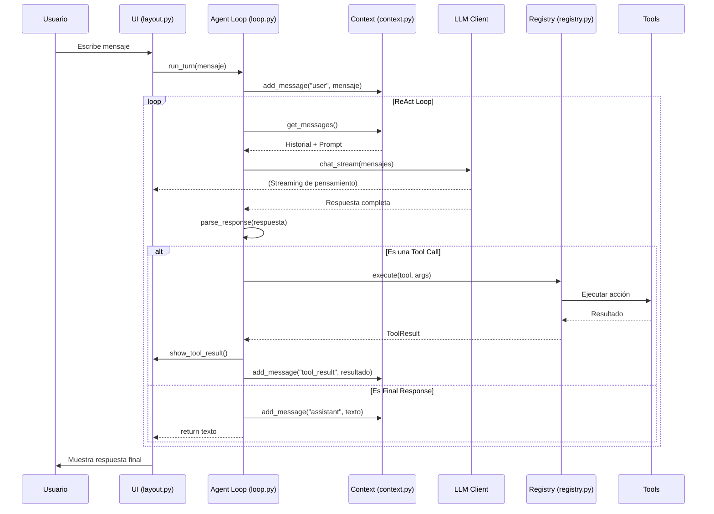

# 🏗️ Arquitectura de TukiCode

Este documento detalla la estructura interna, las funciones de cada archivo y cómo interactúan los componentes para dar vida al agente TukiCode.

## 📁 Estructura del Proyecto

### 🔹 Raíz del Proyecto
- **[tuki.py](file:///d:/software/tukicode/tuki.py)**: Punto de entrada principal (CLI). Gestiona los comandos de nivel superior (`chat`, `config`, `history`, `models`) usando la librería `typer`.
- **[config.py](file:///d:/software/tukicode/config.py)**: Sistema de configuración centralizado. Carga y guarda preferencias desde `tukicode.toml`.
- **[agent_icon.py](file:///d:/software/tukicode/agent_icon.py)**: Contiene el arte ASCII y la lógica de animación para la mascota "Tuki".

### 🔹 Core del Agente (`/agent`)
El motor de inteligencia reside aquí:
- **[loop.py](file:///d:/software/tukicode/agent/loop.py)**: El corazón del agente. Implementa el patrón **ReAct** (Reason + Act). Orquestra el envío de prompts al LLM, la ejecución de herramientas y la actualización del contexto.
- **[context.py](file:///d:/software/tukicode/agent/context.py)**: Gestiona la memoria a corto plazo de la conversación. Incluye lógica para conteo de tokens y compresión de historial si se excede la ventana de contexto.
- **[parser.py](file:///d:/software/tukicode/agent/parser.py)**: Analiza las respuestas del modelo usando expresiones regulares para identificar cuándo el agente quiere usar una herramienta (`ToolCall`) o dar una respuesta final (`FinalResponse`).
- **[ollama_client.py](file:///d:/software/tukicode/agent/ollama_client.py)**: Cliente para interactuar con la API local de Ollama.
- **[openrouter_client.py](file:///d:/software/tukicode/agent/openrouter_client.py)**: Cliente para interactuar con la API de OpenRouter (modelos en la nube).
- **[prompts.py](file:///d:/software/tukicode/agent/prompts.py)**: Define el "System Prompt" que instruye al modelo sobre cómo comportarse y cómo usar las herramientas.

### 🔹 Herramientas (`/tools`)
Capacidades externas del agente:
- **[base.py](file:///d:/software/tukicode/tools/base.py)**: Clases base para herramientas y definición de niveles de riesgo (`LOW`, `MEDIUM`, `HIGH`).
- **[registry.py](file:///d:/software/tukicode/tools/registry.py)**: Registro centralizado donde se dan de alta las herramientas disponibles. Controla los permisos de ejecución basados en el nivel de riesgo configurado.
- **[file_tools.py](file:///d:/software/tukicode/tools/file_tools.py)**: Funciones para manipular el sistema de archivos (leer, escribir, listar, buscar).
- **[shell_tools.py](file:///d:/software/tukicode/tools/shell_tools.py)**: Permite la ejecución de comandos en la terminal del sistema.
- **[search_tools.py](file:///d:/software/tukicode/tools/search_tools.py)**: Integración para realizar búsquedas en la web.

### 🔹 Interfaz de Usuario (`/ui`)
- **[layout.py](file:///d:/software/tukicode/ui/layout.py)**: Define la estructura visual a pantalla completa usando `prompt_toolkit`. Gestiona las ventanas de chat, mascot, banner y barra de tokens.
- **[display.py](file:///d:/software/tukicode/ui/display.py)**: Abstracción de salida para formatear mensajes, errores, tablas y resultados de herramientas de manera atractiva usando `rich`.
- **[input.py](file:///d:/software/tukicode/ui/input.py)**: Define la lógica de manejo de comandos de barra (`/`).

---

## 🔄 Flujo de Interconexión

El siguiente diagrama muestra cómo fluye la información durante un turno de conversación:

## 🛠️ Tecnologías Clave
- **[Rich](https://github.com/Textualize/rich)**: Para el renderizado de texto enriquecido, paneles, tablas y colores en la terminal.
- **[Prompt Toolkit](https://github.com/prompt-toolkit/python-prompt-toolkit)**: Para la gestión de la UI interactiva, atajos de teclado y entrada de usuario multilínea.
- **[Typer](https://typer.tiangolo.com/)**: Para la creación ágil de la interfaz de línea de comandos (CLI).
- **[SQLite](https://www.sqlite.org/)**: Para el almacenamiento persistente del historial de conversaciones.
