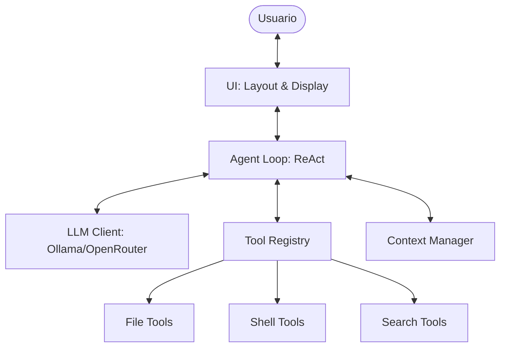

**TukiCode** es un agente de programación inteligente diseñado para ejecutarse localmente, proporcionando una interfaz de chat potente y segura para la manipulación de código, ejecución de comandos y búsqueda de información.

## 🚀 Características Principales

- **Bucle de Razonamiento ReAct**: El agente razona sobre tus peticiones, planea acciones y las ejecuta paso a paso.
- **Doble Motor LLM**: Soporte nativo para **Ollama** (local) y **OpenRouter** (nube).
- **Herramientas de Sistema**: Lectura/Escritura de archivos, ejecución de comandos en terminal y búsqueda web.
- **Seguridad por Niveles**: Control de riesgos (LOW, MEDIUM, HIGH) para prevenir acciones destructivas accidentales.
- **Interfaz Terminal Premium**: UI interactiva a pantalla completa construida con `prompt_toolkit` y `rich`.
- **Persistencia**: Historial de sesiones guardado en una base de datos local SQLite.

## 🛠️ Instalación

1. Asegúrate de tener Python 3.10+ instalado.
2. Instala las dependencias:

   ```bash
   pip install -r requirements.txt
   ```

3. Si usas Ollama, asegúrate de que el servidor esté corriendo:

   ```bash
   ollama serve
   ```

## 📖 Uso

Inicia una sesión de chat interactiva:

```bash
python tuki.py chat
```

### Comandos Disponibles en Chat

- `/help`: Muestra la lista de comandos.
- `/clear`: Limpia la pantalla de la sesión actual.
- `/copy [n]`: Copia el bloque de código `n` de la última respuesta al portapapeles.
- `/exit`: Finaliza la sesión y guarda el historial.

### Comandos de Configuración

```bash
python tuki.py config --setup ollama
python tuki.py config --setup openrouter
```

## 🏗️ Arquitectura de un Vistazo



---
Para una documentación técnica más profunda, consulta [ARCHITECTURE.md](./ARCHITECTURE.md).
