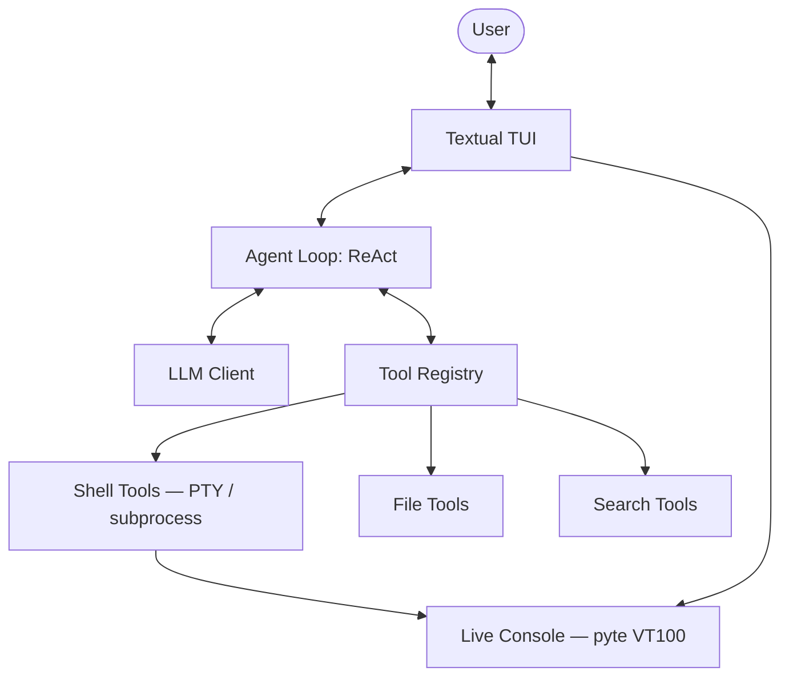

# TukiCode


**TukiCode** is an open-source CLI coding agent built in Python. It runs locally with Ollama or in the cloud with OpenRouter, Gemini, and Anthropic — no subscriptions, no hidden costs.

---

## What's in v1.2.0

- **Full TUI** — Fullscreen interface (Textual) with chat panel, file explorer, and Live Console
- **Interactive Terminal (PTY)** — Real pseudo-terminal for `npm start`, `expo`, and long-running servers
- **Cross-platform** — Windows (`pywinpty`), macOS and Linux (`ptyprocess`)
- **VT100 Emulation** — QR codes and rich terminal output rendered correctly via `pyte`
- **Universal Setup Wizard** — `tuki config --setup` guides you through every provider
- **Multi-Provider** — Ollama (local), OpenRouter, Gemini, Anthropic

---

## Installation

### Windows (PowerShell)

```powershell
iwr https://tukicode.site/api/install.ps1 | iex
```

Downloads `tuki.exe` to `%LOCALAPPDATA%\TukiCode\bin` and adds it to your PATH.

### macOS

```bash
curl -fsSL https://tukicode.site/api/install.sh | bash
```

> **First run on macOS:** If you see a security warning, run:
> ```bash
> xattr -d com.apple.quarantine ~/.local/bin/tuki
> ```

### Linux

```bash
curl -fsSL https://tukicode.site/api/install.sh | bash
```

Both macOS and Linux install `tuki` to `~/.local/bin` and update your shell profile automatically.

### From source (any OS)

```bash
git clone https://github.com/sb4ss/tukicode.git
cd tukicode
pip install -r requirements.txt
python tuki.py chat
```

---

## Quick Start

```bash
# 1. Configure your AI provider
tuki config --setup

# 2. Start the agent
tuki chat
```

---

## Configuration

```bash
tuki config --setup     # Interactive wizard (Ollama / OpenRouter / Gemini / Anthropic)
tuki config             # Show current configuration
tuki config --model     # Change model only
```

### Recommended free models (via OpenRouter)

| Model | Notes |
|---|---|
| `tencent/hy3-preview:free` | ⭐ Recommended — best tool-calling on free tier |
| `moonshotai/kimi-k2.5` | Fast reasoning |
| `deepseek/deepseek-chat-v3.2` | Strong coding tasks |

> TukiCode requires models with **native tool-calling support** for full agent functionality.

---

## Chat Commands

| Command | Description |
|---|---|
| `/help` | List all available commands |
| `/setup` | Open configuration wizard inside the chat |
| `/model` | Switch AI model |
| `/autonomy [low\|medium\|high]` | Control how often the agent asks for confirmation |
| `/risk [low\|medium\|high]` | Adjust risk sensitivity for tool execution |
| `/copy [n]` | Copy code block `n` from the last response |
| `/history` | Show recent sessions |
| `/clear` | Clear the chat log |
| `/exit` | Exit and save the session |

### Keyboard shortcuts

| Shortcut | Action |
|---|---|
| `Ctrl+S` | Emergency stop — halt the current agent execution |
| `Ctrl+B` | Toggle the Live Console panel |
| `Ctrl+L` | Clear chat log |

---

## Requirements

- Python 3.10+
- One of the following:
  - **Ollama** running locally (`ollama serve`)
  - API key for **OpenRouter**, **Gemini**, or **Anthropic**

---

## Architecture

```
tuki.py              ← CLI entry point (Typer)
agent/
  loop.py            ← ReAct reasoning loop
  context.py         ← Token-aware context window
  openrouter_client.py
  gemini_client.py
  anthropic_client.py
tools/
  shell_tools.py     ← Cross-platform PTY + subprocess execution
  file_tools.py      ← Read / Write / Patch files
  search_tools.py    ← Web search
  registry.py        ← Tool registration and dispatch
ui/
  app.py             ← Textual TUI application
  screens.py         ← Modal screens (setup wizard, model selector)
  display.py         ← Live Console panel
config.py            ← TOML configuration manager
```



---

## Building Binaries

Binaries are built automatically via GitHub Actions when a version tag is pushed:

```bash
git tag v1.2.0
git push origin v1.2.0
```

The workflow (`.github/workflows/build.yml`) produces:

| Platform | Binary |
|---|---|
| Windows | `tuki.exe` |
| macOS | `tuki` |
| Linux | `tuki` |

To build manually:

```bash
pip install pyinstaller

# Windows
pyinstaller --onefile --name tuki --hidden-import winpty tuki.py

# macOS / Linux
pyinstaller --onefile --name tuki tuki.py
chmod +x dist/tuki
```

---

For deeper technical documentation, see [ARCHITECTURE.md](./ARCHITECTURE.md).
